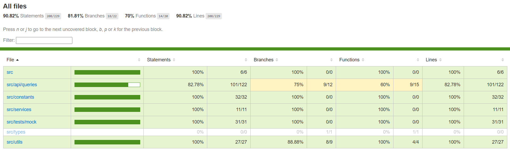

<p align="center">
  
</p>

<p align="center">
  <strong>
    Have fun appreciating beautiful doggos
  </strong>
</p>

<!-- > [!IMPORTANT]
> 👉🏻 Access: [https://doggo.vercel.app/](https://doggo.vercel.app/) -->

<p>&nbsp;</p>

<p align="center">
  
</p>

<p>&nbsp;</p>

<p align="center">
  

  

  
</p>

<p align="center">
  <a href="#computer-features">Features</a>&nbsp;&nbsp;&nbsp;|&nbsp;&nbsp;&nbsp;
  <a href="#gear-settings">Settings</a>&nbsp;&nbsp;&nbsp;|&nbsp;&nbsp;&nbsp;
  <a href="#arrow_down_small-cloning-the-repository">Cloning the repository</a>&nbsp;&nbsp;&nbsp;|&nbsp;&nbsp;&nbsp;
  <a href="#beginner-starting-the-application">Starting the application</a>&nbsp;&nbsp;&nbsp;|&nbsp;&nbsp;&nbsp;
  <a href="#test_tube-running-the-tests">Running the tests</a>&nbsp;&nbsp;&nbsp;|&nbsp;&nbsp;&nbsp;
  <a href="#wrench-techs--tools--resources">Techs | Tools | Resources</a>&nbsp;&nbsp;&nbsp;|&nbsp;&nbsp;&nbsp;
  <a href="#memo-license">License</a>
</p>

### :pushpin: Context

**Doggo** is an application developed by using the [Vite](https://vite.dev/) React framework and the [The Dog API](https://www.thedogapi.com/) and it was created to put in practice what I've studied in the [Testing JavaScript Course](https://github.com/belapferreira/testing-javascript-content) that I took.

**Major assumptions or design choices**

1) I've used TypeScript because you can save time by avoiding bugs due to typos and other errors, it offers faster performance and the IntelliSense works better, generating a superior developer experience.

2) I've chosen the Radix UI because its optimization related to accessibility.

3) About the usage of the Tanstack React Query, the reason is because I think it makes fetching and caching easier to manage and improve the performance of data response, improving the user experience.

4) Tailwind CSS was chosen because with it, we can use pre-built CSS classes for styling, which saves time and effort of writing custom CSS from scratch.

<!-- 7) And finally, for the application deploy, I've picked the Vercel platform because I find it simple to use and also they are able to generate a preview version of the app for each commit done. -->

### :computer: Features

**Done**

- [x] List of doggos;
- [x] Details about the doggo when clicking on its card;
- [x] Ability to filter doggos by type, having breed or not, categories and breeds;
- [x] Ability to navigate between pages;
- [x] Responsive page;
- [x] Unit tests using Vitest and React Testing Library;
- [x] E2E tests using Cypress.

<p align="center">
  
</p>

### :gear: Settings

The settings to execute the application on your computer are listed below.

- [Git](https://git-scm.com);
- [Node](https://nodejs.org/);
- [Yarn](https://yarnpkg.com/).

### :arrow_down_small: Cloning the repository

1. Through the terminal, go to the directory where you want to have the repository cloned and run the following command:

```bash
# cloning the repository
git clone https://github.com/belapferreira/doggo
```

### :beginner: Starting the application

1. Open the code of the repo cloned, duplicate the `.env.example` file and rename to `.env.local`. 

2. Update the `VITE_API_URL` with the API base path and the `VITE_API_KEY` with the key. You can get your [The Dog API](https://www.thedogapi.com/) key by following their guidance.

3. Through the terminal, go to the directory where the repository was cloned and run the following command:

```bash
# installing dependencies
yarn install

# starting application
yarn dev
```

### :test_tube: Running the tests

1. Through the terminal in the directory of the project repository run the following command:

```bash
# running unit tests
yarn test
```

```bash
# running e2e tests
yarn cy:open
```

### :wrench: Techs | Tools | Resources

This project was developed using the following resources:

[Axios](https://axios-http.com/ptbr/docs/intro) | [Cypress](https://www.cypress.io/) | [Eslint](https://eslint.org/) | [Nuqs](https://nuqs.47ng.com/) | [Phosphor Icons](https://phosphoricons.com/) | [Prettier](https://prettier.io/) | [Radix UI Accordion](https://www.radix-ui.com/primitives/docs/components/accordion) | [React Select](https://react-select.com/home) | [Tailwindcss](https://tailwindcss.com/) | [TanStack Query](https://tanstack.com/query/latest) | [TypeScript](https://www.typescriptlang.org/) | [Vite](https://vite.dev/) | [Vitest](https://vitest.dev/) | [Zod](https://zod.dev/)


### :memo: License

This project is under MIT license. See [LICENSE](https://github.com/belapferreira/doggo/blob/master/LICENSE) for more information.

---

Developed by Bela Ferreira :blue_heart: Contact: https://www.linkedin.com/in/belapferreira :blush:
